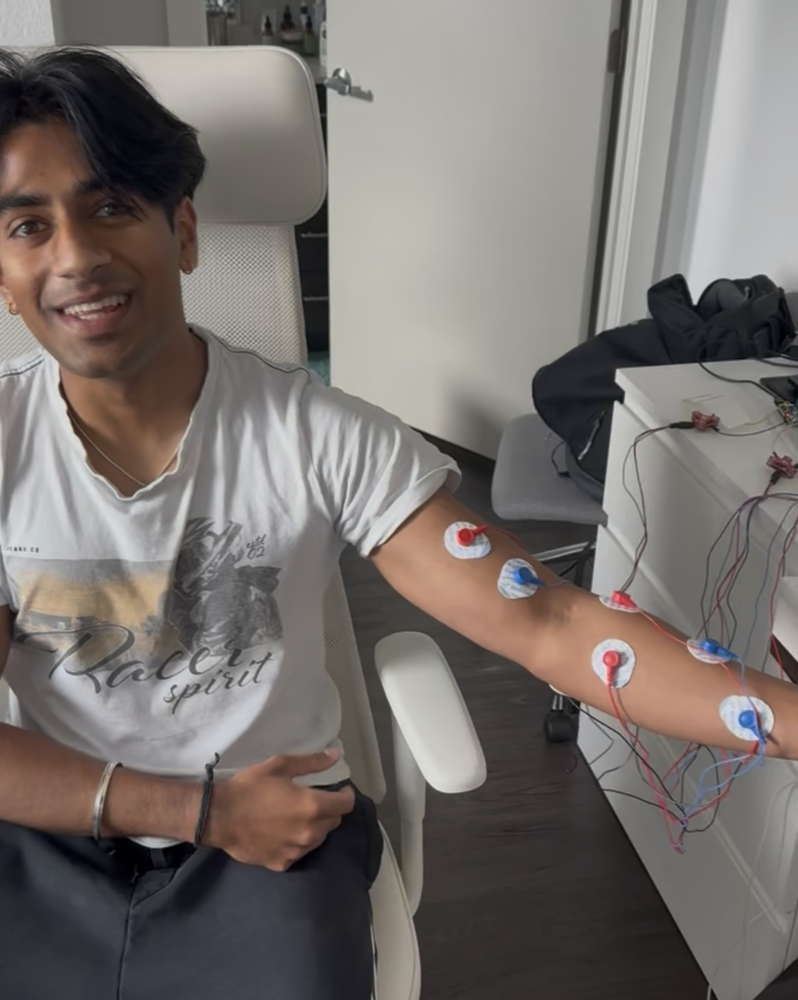
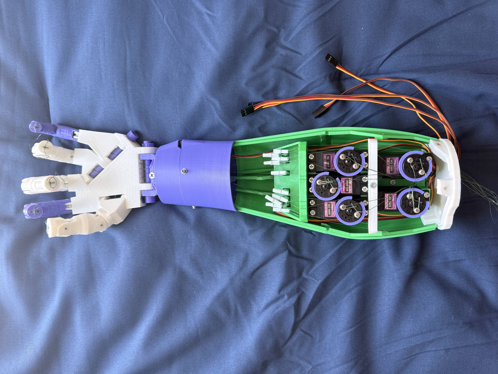
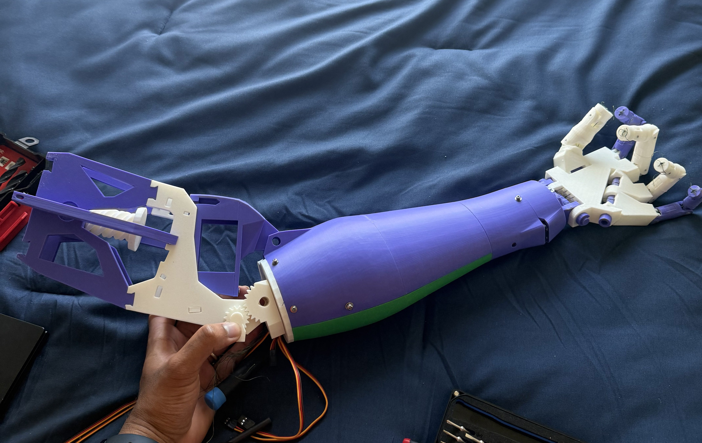

# EMG Winter Soldier Arm

> **Status:** On-device gesture classification is working. Currently integrating servo control with live predictions to close the loop.

A 3D-printed robotic hand controlled by EMG (electromyography) signals from your forearm. Flex your muscles, and the hand moves. The system runs real-time gesture classification entirely on-device using an ESP32-S3, with no laptop required during inference.





### Roadmap

- [x] EMG signal acquisition and filtering (4-channel, 1 kHz DMA)
- [x] Feature extraction pipeline (69 features)
- [x] Python training GUI with data collection, visualization, and model export
- [x] LDA classifier deployed on ESP32
- [x] 3-specialist ensemble deployed on ESP32
- [x] Int8 MLP deployed via TFLite Micro on ESP32
- [x] Multi-model voting with EMA smoothing and debounce
- [x] BLE command interface
- [x] Z-score calibration with NVS persistence
- [x] Servo driver and gesture execution
- [ ] Connect prediction output to servo control (final integration)
- [ ] End-to-end demo: flex forearm, hand moves

## How It Works

Four EMG sensors on your forearm pick up electrical signals from muscle contractions. The ESP32 samples these signals at 1 kHz using DMA, extracts features from sliding windows, and classifies them into gestures. The predicted gesture drives five servo motors (one per finger) to mirror your hand movement in real time.

### Demo

[](https://youtu.be/-MC2RbcCA5s)

### Gestures

| Gesture | Description |
|---------|-------------|
| Rest | Relaxed, hand open (neutral) |
| Fist | All fingers closed |
| Open | All fingers extended |
| Hook 'Em | Index and pinky out, others closed (🤘) |
| Thumbs Up | Thumb extended, others closed |

## System Architecture

```
EMG Sensors (x4)
      │
      ▼
┌─────────────────────────────────────────┐
│  ESP32-S3                               │
│                                         │
│  ADC + DMA (1 kHz per channel)          │
│       │                                 │
│       ▼                                 │
│  IIR Bandpass Filter (20-450 Hz)        │
│       │                                 │
│       ▼                                 │
│  Feature Extraction (69 features)       │
│  RMS, MAV, WL, ZC, SSC, AR, FFT,        │
│  band powers, cross-channel correlation │
│       │                                 │
│       ▼                                 │
│  Multi-Model Voting                     │
│  ┌─────┐  ┌──────────┐  ┌─────┐         │
│  │ LDA │  │ Ensemble │  │ MLP │         │
│  └──┬──┘  └────┬─────┘  └──┬──┘         │
│     └──────────┼───────────┘            │
│                ▼                        │
│  EMA Smoothing + Majority Vote          │
│  + Debounce                             │
│       │                                 │
│       ▼                                 │
│  Servo Driver (5 fingers, 50 Hz PWM)    │
└─────────────────────────────────────────┘
      │
      ▼
  Robotic Hand
```

## Hardware Pinout

| Component | GPIO | Notes |
|-----------|------|-------|
| Thumb Servo | GPIO 1 | LEDC Channel 0 |
| Index Servo | GPIO 4 | LEDC Channel 1 |
| Middle Servo | GPIO 5 | LEDC Channel 2 |
| Ring Servo | GPIO 6 | LEDC Channel 3 |
| Pinky Servo | GPIO 7 | LEDC Channel 4 |
| EMG Ch0 (FCR/Belly) | GPIO 2 | ADC1 Channel 1 |
| EMG Ch1 (Extensors) | GPIO 3 | ADC1 Channel 2 |
| EMG Ch2 (FCU/Outer Flexors) | GPIO 9 | ADC1 Channel 8 |
| EMG Ch3 (Bicep) | GPIO 10 | ADC1 Channel 9 |

All servos run at 50 Hz PWM with 14-bit resolution. Duty cycle range: 430 (0 degrees, extended) to 2048 (180 degrees, flexed).

## Classification Models

Three models run in parallel on the ESP32 and vote on each prediction. Using multiple classifiers with different strengths makes the system more robust than any single model alone.

**LDA (Linear Discriminant Analysis)**
Lightweight linear classifier trained on all 69 features. Fast to run, serves as the baseline predictor. Weights are exported as a C header and compiled directly into firmware.

**3-Specialist Ensemble**
Three separate LDA classifiers, each trained on a different feature subset:
- *Time-domain specialist*: RMS, MAV, waveform length, zero crossings, slope sign changes
- *Frequency-domain specialist*: Mean/median frequency, peak frequency, band powers
- *Cross-channel specialist*: Correlation coefficients between EMG channels

A meta-LDA combines their outputs into a final classification. Different gestures are more separable in different feature spaces, so specializing gives better accuracy than a single model on all features.

**Int8 MLP (TFLite Micro)**
A small multi-layer perceptron quantized to int8 and deployed via TensorFlow Lite Micro. Captures nonlinear decision boundaries that LDA misses.

**Voting and Smoothing**
The three models each cast a vote. The final prediction is then passed through EMA smoothing, a sliding-window majority vote, and transition debounce to prevent jittery servo movement.

## Features

- **On-device inference**: All classification runs on the ESP32-S3. No laptop in the loop.
- **69 EMG features**: Time-domain (RMS, MAV, waveform length, zero crossings, slope sign changes, Hjorth parameters, autoregressive coefficients), frequency-domain (mean/median frequency, peak frequency, spectral band powers via FFT), and cross-channel correlation.
- **Z-score calibration**: Per-user calibration stored in NVS flash, so the system adapts to different forearm placements and muscle strengths.
- **Full training pipeline**: Python GUI for data collection, signal visualization, model training, and live prediction. Train a new model and export C header weights in one workflow.
- **BLE control**: Connect via Bluetooth to start/stop streaming, trigger calibration, or switch between on-device and laptop-side prediction.

## Tech Stack

**Firmware (C/C++)**
- ESP-IDF on ESP32-S3 (PlatformIO)
- FreeRTOS for task scheduling
- DMA-based ADC sampling at 1 kHz
- esp-dsp library for FFT
- TensorFlow Lite Micro for MLP inference
- LEDC PWM for servo control
- NimBLE for Bluetooth Low Energy
- NVS flash for calibration persistence

**Training Pipeline (Python)**
- scikit-learn for LDA and ensemble training
- TensorFlow/TFLite for MLP quantization (int8)
- NumPy, SciPy for signal processing
- CustomTkinter GUI for data collection and visualization
- Automated C header export for model weights

## Project Structure

```
EMG_Arm/                        # ESP32 firmware (PlatformIO project)
├── src/
│   ├── app/main.c              # State machine, BLE commands, multi-model voting
│   ├── config/config.h         # Pin definitions, constants, gesture enums
│   ├── core/
│   │   ├── inference.c/h       # LDA classifier, 69-feature extraction, IIR filter
│   │   ├── inference_ensemble.c/h  # 3-specialist LDA ensemble (TD/FD/CC)
│   │   ├── inference_mlp.cc/h  # Int8 MLP via TFLite Micro
│   │   ├── calibration.c/h     # Z-score calibration with NVS storage
│   │   ├── gestures.c/h        # Gesture definitions and finger mappings
│   │   ├── bicep.c/h           # Bicep curl detection
│   │   ├── model_weights.h     # Exported LDA weights
│   │   └── model_weights_ensemble.h  # Exported ensemble weights
│   ├── drivers/
│   │   ├── emg_sensor.c/h      # ADC + DMA driver
│   │   └── hand.c/h            # Per-finger servo control
│   └── hal/
│       └── servo_hal.c/h       # Low-level PWM servo driver
├── platformio.ini
└── partitions.csv

# Python training and data collection
emg_gui.py                      # Full GUI: collect data, train models, live predict
learning_data_collection.py     # Data collection pipeline and feature extraction
learning_emg_filtering.py       # Signal filtering experiments
train_ensemble.py               # 3-specialist ensemble trainer, exports C headers
train_mlp_tflite.py             # MLP training and TFLite int8 quantization
live_predict.py                 # Laptop-side live prediction over serial
serial_stream.py                # Serial communication with ESP32
requirements.txt                # Python dependencies
```

## Getting Started

### Firmware

1. Install [PlatformIO](https://platformio.org/)
2. Open the `EMG_Arm/` folder as a PlatformIO project
3. Build and flash to an ESP32-S3:
   ```
   pio run -t upload
   ```
4. Monitor serial output:
   ```
   pio device monitor -b 921600
   ```

### Training Pipeline

1. Install Python dependencies:
   ```
   pip install -r requirements.txt
   ```
2. Launch the GUI:
   ```
   python emg_gui.py
   ```
3. Collect training data (guided gesture prompts with live EMG visualization)
4. Train models (LDA, ensemble, MLP) from the GUI
5. Export weights to C headers for on-device deployment

## Acknowledgments

Built by [Surya Balaji](https://github.com/SuryaUT) and [Aditya Pulipaka](https://github.com/pulipakaa24).

The robotic hand is based on the [InMoov](https://inmoov.fr/) open-source robot designed by [Ga&euml;l Langevin](https://inmoov.fr/build-yours/), licensed under [CC BY-NC](https://creativecommons.org/licenses/by-nc/4.0/).
