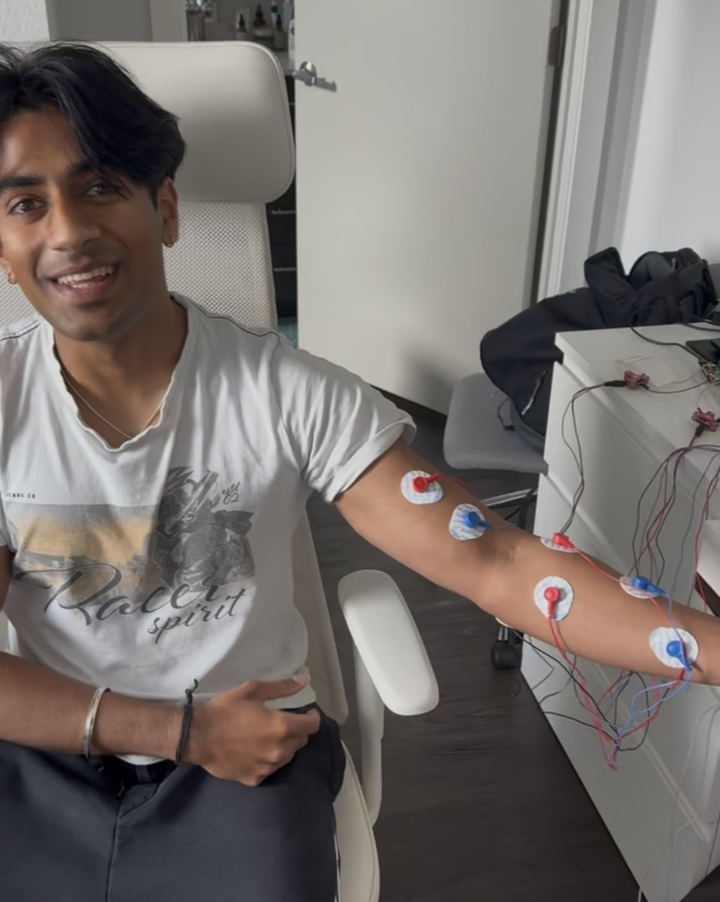
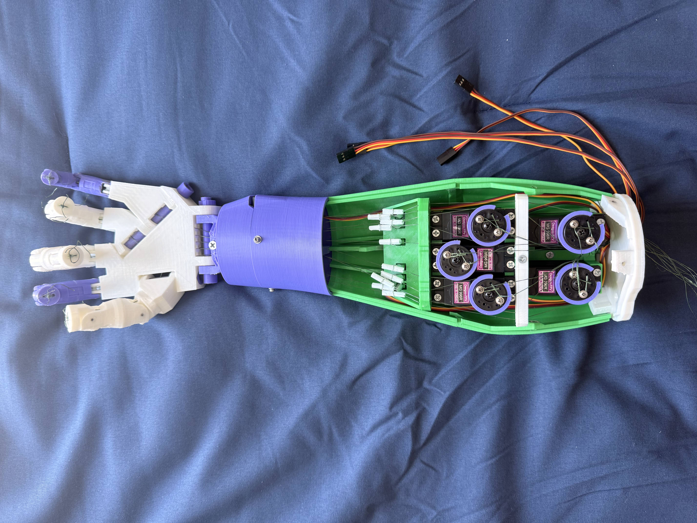
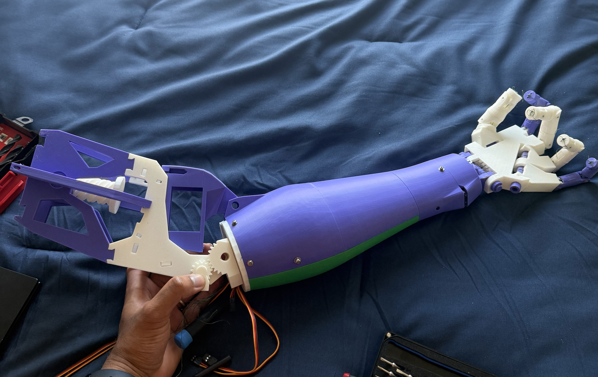

# EMG Winter Soldier Arm

> **Status:** Complete and working end to end — flex your forearm and the hand forms the gesture; flex your bicep and the arm lifts proportionally. All inference runs on the ESP32-S3.

A 3D-printed robotic hand controlled by EMG (electromyography) signals from your forearm. Flex your muscles, and the hand moves. The system runs real-time gesture classification entirely on-device using an ESP32-S3, with no laptop required during inference.





**Want to build one?** → [Bill of Materials](#bill-of-materials) · [Build It Yourself](#build-it-yourself),
a phase-by-phase guide from "learn EMG on public data" to "the arm moves when you flex."
You can start Phase 0 today with no hardware at all.

### Roadmap

- [x] EMG signal acquisition and filtering (4-channel, 1 kHz DMA)
- [x] Feature extraction pipeline (69 features)
- [x] Python training GUI with data collection, visualization, and model export
- [x] LDA classifier deployed on ESP32
- [x] 3-specialist ensemble deployed on ESP32
- [x] Int8 MLP deployed via TFLite Micro on ESP32
- [x] Multi-model voting with EMA smoothing and hysteresis
- [x] Z-score calibration with NVS persistence
- [x] Servo driver and gesture execution
- [x] Connect prediction output to servo control (final integration)
- [x] End-to-end demo: flex forearm, hand moves | flex bicep, bicep moves

## How It Works

Four EMG sensors on your forearm pick up electrical signals from muscle contractions. The ESP32 samples these signals at 1 kHz using DMA, extracts features from sliding windows, and classifies them into gestures. The predicted gesture drives five servo motors (one per finger) to mirror your hand movement in real time.

### Demo

[](https://youtu.be/6voH-t2C3i8)

https://github.com/user-attachments/assets/e729b2e2-c2a5-4b85-913b-dc0e85c602e7

### Gestures

| Gesture | Description |
|---------|-------------|
| Rest | Relaxed, hand open (neutral) |
| Fist | All fingers closed |
| Open | All fingers extended |
| Hook 'Em | Index and pinky out, others closed (🤘) |
| Thumbs Up | Thumb extended, others closed |

## System Architecture

```
EMG Sensors (x4)
      │
      ▼
┌─────────────────────────────────────────┐
│  ESP32-S3                               │
│                                         │
│  ADC + DMA (1 kHz per channel)          │
│       │                                 │
│       ▼                                 │
│  IIR Bandpass Filter (20-450 Hz)        │
│       │                                 │
│       ▼                                 │
│  Feature Extraction (69 features)       │
│  RMS, MAV, WL, ZC, SSC, AR, FFT,        │
│  band powers, cross-channel correlation │
│       │                                 │
│       ▼                                 │
│  Multi-Model Voting                     │
│  ┌─────┐  ┌──────────┐  ┌─────┐         │
│  │ LDA │  │ Ensemble │  │ MLP │         │
│  └──┬──┘  └────┬─────┘  └──┬──┘         │
│     └──────────┼───────────┘            │
│                ▼                        │
│  EMA Smoothing + Hysteresis             │
│  (enter 0.70 / hold 0.25)               │
│       │                                 │
│       ▼                                 │
│  Servo Driver (5 fingers, 50 Hz PWM)    │
└─────────────────────────────────────────┘
      │
      ▼
  Robotic Hand
```

## Hardware Pinout

Servos are **not** driven from ESP32 GPIOs. The ESP32 talks I²C to a PCA9685, which
generates all seven servo pulses — that keeps servo current off the dev board entirely.

**ESP32-S3 pins** (`src/config/config.h`, `src/drivers/emg_sensor.c`)

| Signal | GPIO | Notes |
|--------|------|-------|
| EMG Ch0 (FCR / flexor belly) | GPIO 2 | ADC1 channel 1 |
| EMG Ch1 (extensors) | GPIO 3 | ADC1 channel 2 |
| EMG Ch2 (FCU / outer flexors) | GPIO 9 | ADC1 channel 8 |
| EMG Ch3 (bicep) | GPIO 10 | ADC1 channel 9 |
| I²C SDA → PCA9685 | GPIO 8 | 400 kHz fast mode |
| I²C SCL → PCA9685 | GPIO 7 | 400 kHz fast mode |

**PCA9685 channels** (`config.h`, `PCA_CH_*`)

| Channel | Servo | Channel | Servo |
|---------|-------|---------|-------|
| 0 | Thumb | 4 | Pinky |
| 1 | Index | 5 | Wrist |
| 2 | Middle | 6 | Bicep (HS-805BB) |
| 3 | Ring | | |

Servos run at 50 Hz. The PCA9685 is a 12-bit controller, so duty is expressed in ticks of
20 ms / 4096 ≈ 4.88 µs: `SERVO_DUTY_MIN` 110 (≈540 µs, 0°/extended) to `SERVO_DUTY_MAX` 510
(≈2490 µs, 180°/flexed). Expect to retune these per servo — see Phase 7.

> **Power:** the PCA9685's V+ rail comes from the UBEC, never from the ESP32's 5 V pin. Seven
> MG996R/HS-805BB servos can pull well over 10 A stalled, which will brown out or kill the dev
> board. The ESP32 ground, UBEC ground, and PCA9685 ground **must** be tied together.

## Bill of Materials

**Role** — `Build` ships inside the finished arm · `Tool` you use and keep · `Consumable` gets
used up · `Optional` nice to have.

### Electronics

| Item | Qty | Role | Link | Notes |
|------|-----|------|------|-------|
| ESP32-S3-DevKitC-1, N16R16 (16 MB flash / 16 MB PSRAM) | 1 | Build | [*(link)*](https://a.co/d/01Zu2owI) | `platformio.ini` configures 32 MB; adjust `board_upload.flash_size` + `partitions.csv` for your variant |
| MyoWare 2.0 Muscle Sensor | 4 | Build | [*(link)*](https://www.amazon.com/MyoWare-DEV-27924-2-Muscle-Sensor/dp/B0DX624319/ref=sr_1_1?dib=eyJ2IjoiMSJ9.v5-Px_ad26wSnFEfUGOUK5HHLwoZUUjlxa0zemubPmrwtG0NBcjCJZtSv4g54TZiXpmF7KPmmxXB_kJlRST7QGOVnEGflzkCr6MYA5SIZmtaRoeqBOat3yBYwjlSZaxGF_d_IAL2t9k59noDEQREbA.c_ErMeYEB7pXSrFJofNaYj8G8Z07VQRzO2fn5DXQTEU&dib_tag=se&keywords=myoware+muscle+sensor&qid=1785292872&sr=8-1) | 3 forearm + 1 bicep |
| MyoWare 2.0 Cable Shield | 4 | Build | [*(link)*](https://www.sparkfun.com/myoware-2-0-cable-shield.html) | Breaks the sensor out to a standard cable — one per sensor |
| 3-Lead Electrode Sensor Cable (snap connectors) | 4 | Build | [*(link)*](https://www.digikey.com/en/products/detail/sparkfun-electronics/12970/6833933?gclsrc=aw.ds&gad_source=4&gad_campaignid=20232005509&gbraid=0AAAAADrbLliTwurUgMbroaDIsc7uZVEOk&gclid=CjwKCAjwpqHTBhAcEiwAj2AfusFTLBP524ra8qG8XtxSopLvLCPZ8QOEuEz0MOZcQxD1wLX_tgoRfxoCaF0QAvD_BwE) | Lets you place electrodes remotely instead of snapping the board to your skin |
| Disposable Ag/AgCl Surface EMG Electrodes | ~100 | Consumable | [*(link)*](https://a.co/d/05unx08C) | 3 per sensor per session. Buy far more than you think |
| PCA9685 16-Channel 12-bit PWM/Servo Driver (I²C) | 1 | Build | [*(link)*](https://a.co/d/03bYEglJ) | Address 0x40 by default |
| UBEC / Switching BEC, 6 V output, ≥5 A | 1 | Build | [*(link)*](https://a.co/d/0gzf33Go) | Steps the LiPo down to servo voltage. A linear regulator will overheat. Be careful, mine blew up because of back EMG :( |
| LiPo Battery Pack, 7.4V 1000 mAh 35C | 1–2 | Build | [*(link)*](https://a.co/d/0gQ62Iaj) | 30C ≈ 36 A burst, which is what the stall current needs |
| Solderless Breadboard, 830-point | 1 | Build | [*(link)*](https://a.co/d/0aHjkt24) | |
| Jumper Wires (M-M and M-F) | 1 kit | Build | [*(link)* ](https://a.co/d/098IxODU)| |
| 3-Conductor Servo Extension Wire | ~5 m | Build | [*(link)* ](https://a.co/d/0bHubucZ)| Forearm servos sit far from the PCA9685 |
| Digital Multimeter | 1 | Tool | [*(link)*](https://a.co/d/0h7MyC6Q) | For continuity, rail voltage, and I²C debugging |

### Actuators

| Item | Qty | Role | Link | Notes |
|------|-----|------|------|-------|
| MG996R Metal-Gear Servo, 180° | 6 | Build | [*(link)*](https://a.co/d/0fHCpXH0) | 5 fingers + wrist. Buy a spare — gears strip |
| Hitec HS-805BB Mega Giant-Scale Servo | 1 | Build | [*(link)*](https://a.co/d/09RSyvfb) | Bicep only. Needs the torque to lift the forearm |

### Mechanical / printed parts

| Item | Qty | Role | Link | Notes |
|------|-----|------|------|-------|
| 3D Printer | 1 | Tool | access | Or a print service |
| Braided Fishing Line, ~50 lb | 1 spool | Build | [*(link)*](https://a.co/d/0hsfSs5g) | InMoov tendons. Braided, **not** monofilament — mono stretches |
| Extension Spring Assortment (**loop ends both sides**) | 1 kit | Build | [*(link)*](https://a.co/d/00P6AhfA) | The loops are what hook into the finger returns |
| Steel Wire, ~1.5 mm | ~1 m | Build | [*(link)*](https://a.co/d/0e5UOqwR) | Finger joint pins |
| Machine Screw Assortment, M3 | 1 kit | Build | [*(link)* ](https://a.co/d/01VloJq8)| Non-self-tapping. See InMoov per-part sizes |
| Self-Tapping Screw Assortment, M2–M3 | 1 kit | Build | [*(link)*](https://a.co/d/07lniRKH) | Bites directly into printed plastic |
| Bolt & Nut Assortment, M3 (~10 mm / ⅜ in) | 1 kit | Build | [*(link)*](https://a.co/d/03Ur42Af) | One size smaller also works in most spots |

### Tools & consumables

| Item | Qty | Role | Link | Notes |
|------|-----|------|------|-------|
| Soldering Iron Kit | 1 | Tool | [*(link)*](https://a.co/d/02wGKQ0J) | |
| Wire Strippers | 1 | Tool | [*(link)* ](https://a.co/d/07zsa6Tv)| |
| Precision Screwdriver Set | 1 | Tool | [*(link)* ](https://a.co/d/0cbxM4zT)| |
| Needle File Set | 1 | Tool | [*(link)*](https://a.co/d/0av92Gj7) | Cleaning up print seams and tendon channels |
| Drill Bit Set, 1–4 mm (+ pin vise or rotary tool) | 1 | Tool | [*(link)* ](https://a.co/d/0dqA5nTE)| Reaming holes that printed undersize |
| Electrical Tape | 1 roll | Consumable | [*(link)*](https://a.co/d/00nZZ1Ma) | |
| Spiral Cable Wrap | ~2 m | Build | [*(link)*](https://a.co/d/01rqrUJs) | Bundles the servo/sensor runs down the forearm |
| Isopropyl Alcohol Wipes | 1 box | Consumable | [*(link)*](https://a.co/d/07eMzxHi) | Skin prep. Dramatically lowers electrode impedance |
| Compression Arm Sleeve | 1 | Optional | [*(link)*](https://a.co/d/052m7mYf) | Holds electrodes down after placement; noticeably reduces motion artifacts |

> **Safety:** you are sticking electrodes to your skin. Run the ESP32 from a battery or a
> properly isolated USB supply during recording — do not have electrodes on your arm while the
> board is tied to a mains-powered laptop that is itself plugged in and charging. Treat LiPos
> with respect: charge in the bag, never leave them unattended, never puncture a swollen pack.

## Classification Models

Three models run in parallel on the ESP32 and vote on each prediction. Using multiple classifiers with different strengths makes the system more robust than any single model alone.

**LDA (Linear Discriminant Analysis)**
Lightweight linear classifier trained on all 69 features. Fast to run, serves as the baseline predictor. Weights are exported as a C header and compiled directly into firmware.

**3-Specialist Ensemble**
Three separate LDA classifiers, each trained on a different feature subset:
- *Time-domain specialist*: RMS, MAV, waveform length, zero crossings, slope sign changes
- *Frequency-domain specialist*: Mean/median frequency, peak frequency, band powers
- *Cross-channel specialist*: Correlation coefficients between EMG channels

A meta-LDA combines their outputs into a final classification. Different gestures are more separable in different feature spaces, so specializing gives better accuracy than a single model on all features.

**Int8 MLP (TFLite Micro)**
A small multi-layer perceptron quantized to int8 and deployed via TensorFlow Lite Micro. Captures nonlinear decision boundaries that LDA misses.

**Voting and Smoothing**
The three models' probabilities are averaged, then passed through an EMA (alpha 0.70) and a hysteresis gate: it takes high confidence (0.70) to *switch* to a new gesture, but very little (0.25) to *hold* the current one. That asymmetry is what keeps the servos from chattering on borderline windows.

## Features

- **On-device inference**: All classification runs on the ESP32-S3. No laptop in the loop.
- **69 EMG features**: Time-domain (RMS, MAV, waveform length, zero crossings, slope sign changes, Hjorth parameters, autoregressive coefficients), frequency-domain (mean/median frequency, peak frequency, spectral band powers via FFT), and cross-channel correlation.
- **Z-score calibration**: Per-user calibration stored in NVS flash, so the system adapts to different forearm placements and muscle strengths.
- **Full training pipeline**: Python GUI for data collection, signal visualization, model training, and live prediction. Train a new model and export C header weights in one workflow.
- **Runs without hardware**: a recorded EMG session is compiled into the firmware, so you can build, flash, and watch the full inference pipeline classify gestures with no sensors attached (see [Running without sensors](#running-without-sensors)).

## Tech Stack

**Firmware (C/C++)**
- ESP-IDF on ESP32-S3 (PlatformIO)
- FreeRTOS for task scheduling
- DMA-based ADC sampling at 1 kHz
- esp-dsp library for FFT
- TensorFlow Lite Micro for MLP inference
- LEDC PWM for servo control
- NVS flash for calibration persistence

**Training Pipeline (Python)**
- scikit-learn for LDA and ensemble training
- TensorFlow/TFLite for MLP quantization (int8)
- NumPy, SciPy for signal processing
- CustomTkinter GUI for data collection and visualization
- Automated C header export for model weights

## Project Structure

```
EMG_Arm/                        # ESP32 firmware (PlatformIO project)
├── src/
│   ├── app/main.c              # State machine, serial commands, multi-model voting
│   ├── config/config.h         # Pin definitions, constants, gesture enums
│   ├── core/
│   │   ├── inference.c/h       # LDA classifier, 69-feature extraction, IIR filter
│   │   ├── inference_ensemble.c/h  # 3-specialist LDA ensemble (TD/FD/CC)
│   │   ├── inference_mlp.cc/h  # Int8 MLP via TFLite Micro
│   │   ├── calibration.c/h     # Z-score calibration with NVS storage
│   │   ├── gestures.c/h        # Gesture definitions and finger mappings
│   │   ├── bicep.c/h           # Bicep curl detection
│   │   ├── model_weights.h     # Exported LDA weights
│   │   └── model_weights_ensemble.h  # Exported ensemble weights
│   ├── drivers/
│   │   ├── emg_sensor.c/h      # ADC + DMA driver
│   │   ├── replay_data.c/h     # Recorded EMG session used when LIVE_EMG=0
│   │   └── hand.c/h            # Per-finger servo control
│   └── hal/
│       └── servo_hal.c/h       # Low-level PWM servo driver
├── components/                 # esp-dsp, esp-nn, esp-tflite-micro (not committed)
├── platformio.ini
└── partitions.csv

tools/                          # Firmware/Python parity harness
├── parity_capture.py           # Capture a PARITY_DUMP run off the board
├── parity_compare.py           # Diff on-device features against Python, feature by feature
└── hdf5_to_replay.py           # Turn an HDF5 recording into replay_data.c

# Python training and data collection
emg_gui.py                      # Full GUI: collect data, train models, live predict
learning_data_collection.py     # Data collection pipeline and feature extraction
learning_emg_filtering.py       # Signal filtering experiments
train_ensemble.py               # 3-specialist ensemble trainer, exports C headers
train_mlp_tflite.py             # MLP training and TFLite int8 quantization
live_predict.py                 # Laptop-side live prediction over serial
serial_stream.py                # Serial communication with ESP32
requirements.txt                # Python dependencies
```

## Getting Started

### What you need

**Software**
- [PlatformIO Core](https://docs.platformio.org/en/latest/core/installation/) (or the VS Code extension) — pulls in the ESP-IDF 5.5 toolchain on first build
- Python 3.11+ and `git`

**Hardware** (only for live EMG — the firmware also runs on recorded data, see below)
- ESP32-S3 DevKitC-1, N16R16 variant (32 MB flash configured in `platformio.ini`)
- 4x MyoWare (or equivalent) EMG sensors + electrodes
- PCA9685 servo driver and 5x hobby servos, plus a 3D-printed [InMoov](https://inmoov.fr/build-yours/) hand

### 1. Clone and fetch the vendored ESP-IDF components

Three ESP-IDF components are used but **not** committed to this repo — clone them into
`EMG_Arm/components/` before your first build. These are the exact revisions this project
was built and tested against:

```bash
git clone https://github.com/SuryaUT/EMG-Winter-Soldier-Arm.git
cd EMG-Winter-Soldier-Arm/EMG_Arm

mkdir -p components && cd components
git clone https://github.com/espressif/esp-dsp.git          && git -C esp-dsp          checkout 23ee959
git clone https://github.com/espressif/esp-nn.git           && git -C esp-nn           checkout v1.1.2
git clone https://github.com/espressif/esp-tflite-micro.git && git -C esp-tflite-micro checkout 9514001
```

- **esp-dsp** — FFT for the frequency-domain features. Required whenever `MODEL_EXPAND_FEATURES=1` (the default, 69 features).
- **esp-tflite-micro** + **esp-nn** — the int8 MLP. Required whenever `MODEL_USE_MLP=1` (the default). Both flags live in `src/core/model_weights.h`; set them to `0` to build without the corresponding component.

### 2. Build and flash

```bash
pio run -t upload            # from EMG_Arm/
pio device monitor -b 921600
```

`sdkconfig.esp32-s3-devkitc1-n16r16` is generated on the first build from `sdkconfig.defaults`
plus `platformio.ini`; it is not committed. If a build ever goes strange, delete it and rebuild.

### 3. Pick a build mode

Two independent compile-time switches decide what the firmware does:

| Switch | Where | Meaning |
|--------|-------|---------|
| `MAIN_MODE` | `src/config/config.h` | Which loop runs: `REAL_MAIN` (full app), `SERVO_CALIBRATOR_*`, `GESTURE_TESTER`, `EMG_STANDALONE`, `PARITY_DUMP`, … |
| `LIVE_EMG` | `src/drivers/emg_sensor.h` | Data source: `1` = real ADC/electrodes, `0` = replay a recorded session from flash |

`ENABLE_HAND` and `ENABLE_BICEP` in `config.h` independently gate the finger-servo and bicep-servo subsystems.

### Running without sensors

Set `LIVE_EMG 0` in `src/drivers/emg_sensor.h` and leave `MAIN_MODE` at `REAL_MAIN`. A recorded
EMG session is compiled into the binary (`src/drivers/replay_data.c`), so the entire pipeline —
filtering, 69 features, all three models, voting — runs and prints predictions with nothing
plugged in. This is the fastest way to confirm your toolchain is set up correctly.

### 4. Training pipeline

```bash
python -m venv .venv && source .venv/bin/activate   # Windows: .venv\Scripts\activate
pip install -r requirements.txt
pip install tensorflow      # only needed to retrain/quantize the MLP
python emg_gui.py
```

From the GUI: collect training data (guided gesture prompts with live EMG visualization), train
the models, and export the weights as C headers. `train_ensemble.py` and `train_mlp_tflite.py`
write `src/core/model_weights.h`, `model_weights_ensemble.h`, and `emg_model_data.cc` directly —
rebuild the firmware afterward to deploy them.

### What's not in this repo (and how to regenerate it)

Recordings and trained binaries are excluded to keep the repo small. Everything needed to
*rebuild* them is here:

| Not committed | How to get it |
|---------------|---------------|
| `EMG_Arm/components/` | Clone commands in step 1 above |
| `collected_data/`, `extra_data/`, `assets/` (HDF5 recordings) | Record your own via `python emg_gui.py`. EMG is highly user- and placement-specific, so your own data will outperform someone else's anyway. |
| `models/*.joblib`, `*.npz` | Retrain from your recordings (`train_ensemble.py`, `train_mlp_tflite.py`) |
| `EMG_Arm/sdkconfig.esp32-*` | Generated on first build |
| Serial dumps and logs | Byproducts of debugging; see `tools/parity_capture.py` |

The exported C headers (`model_weights.h`, `model_weights_ensemble.h`, `emg_model_data.cc`) **are**
committed, so the firmware builds and classifies out of the box using the original author's models.
Retrain and re-export them to adapt the system to your own forearm.

## Build It Yourself

The order below is deliberate: it front-loads the things that teach you something, overlaps the
long shipping lead times with the printing, and defers every hard-to-debug integration until each
piece has been verified alone. Expect **6–10 weeks** at hobby pace, most of it printing.

| Phase | What you're doing | Blocked by |
|-------|-------------------|------------|
| 0 | Learn feature extraction on public data | nothing — start today |
| 1 | Order hardware | budget |
| 2 | Print and assemble the arm | printer time |
| 3 | Write the sensor driver, collect your own data | sensors arriving |
| 4 | Train models + tune post-processing | your data |
| 5 | Validate on your laptop | a trained model |
| 6 | Deploy to the ESP32 | a model you like |
| 7 | Write the arm control stack | assembled arm |
| 8 | Connect model → arm, add proportional bicep control | 6 and 7 |

---

### Phase 0 — Learn the signal before you spend money

Download Meta's open sEMG dataset and get comfortable with the pipeline while your parts are
still in the cart:

**https://fb-ctrl-oss.s3.amazonaws.com/generic-neuromotor-interface-data**

Load it, window it, and run it through `EMGFeatureExtractor` in `learning_data_collection.py`.
`learning_emg_filtering.py` is a scratchpad for the filtering half.

> **Important caveat:** Meta's data is wrist-worn, with a different channel count, electrode
> layout, and sample rate than this build. You **cannot** train a model on it and deploy that
> model here. Use it to learn the *pipeline* — what a 150-sample window looks like, what a 20–450 Hz
> bandpass removes, why RMS and waveform length track contraction strength, what mean/median
> frequency say about fatigue. That understanding is the entire point of this phase.

**You're done when** you can explain, without looking it up, what each of these measures and why
it helps separate gestures: RMS, MAV, waveform length, zero crossings, slope sign changes, Hjorth
parameters, AR coefficients, mean/median/peak frequency, band powers, and cross-channel correlation.
Those are the 69 features. If they're a black box now, every later debugging session is guesswork.

### Phase 1 — Order hardware (do this first, it ships slowest)

Work through the [Bill of Materials](#bill-of-materials). Order the **sensors, electrodes, servos,
and the HS-805BB first** — they have the longest lead times, and everything in Phase 3 onward is
blocked on them. Filament and hand tools you can get locally later.

### Phase 2 — Print and assemble the arm

Print from [InMoov](https://inmoov.fr/build-yours/). You need the **hand and forearm**; the **bicep**
is required for the proportional-control half of this project. Note that the InMoov bicep mounts to
the shoulder, so you'll want at least the shoulder parts it bolts to even if you skip a full
articulated shoulder.

Practical notes that will save you a reprint:
- **PETG for tendon-loaded and spring-loaded parts.** PLA creeps under sustained tension and your
  fingers will slowly go slack over weeks. PLA is fine for cosmetic covers.
- Print the finger parts at high infill (~40%+); they take the entire tendon load.
- Ream tendon channels and joint holes with the drill bits before assembly — printed holes come out
  undersize and you cannot fix it once the finger is together.
- Use **braided** fishing line. Monofilament stretches and your calibration will drift within a day.
- **Bench-test every servo before you install it.** Sweep each one through its full range on the
  breadboard first. Finding a dead or stripped MG996R after it's buried in a glued forearm is a
  genuinely miserable afternoon.
- Don't fully tension the tendons yet — you'll set final tension in Phase 7 once you know each
  servo's real endpoints.

**You're done when** you can pull each tendon by hand and watch the corresponding finger curl and
spring back cleanly.

### Phase 3 — Sensor driver + your own data

Now write the acquisition layer. In this repo that's `src/drivers/emg_sensor.c`: continuous ADC DMA
across 4 channels at 1 kHz, plus the IIR bandpass in `inference.c`. Read it, but write your own — the
sampling loop is where you learn how much of EMG quality is just clean acquisition.

**Sensor placement.** Channels 0–2 go on the forearm (`HAND_CHANNELS = [0, 1, 2]`): flexor carpi
radialis / flexor belly, the extensor group, and flexor carpi ulnaris / outer flexors. Channel 3
goes on the bicep. Feel for the muscle belly while contracting and put the two electrodes along the
fiber direction, reference on a bony landmark.

**Skin prep matters more than anything else in this project.** Shave the area, wipe with alcohol,
let it dry fully, then apply electrodes. A compression sleeve over the top holds them down and cuts
motion artifacts noticeably.

**Before recording a full session, look at the raw signal.** Stream it and confirm you see a clean
flat baseline at rest and a sharp burst on contraction. If the baseline is noisy or you see 60 Hz
hum, fix it now — no amount of modeling recovers bad electrodes.

Record with `python emg_gui.py`, which prompts gestures on a schedule and writes HDF5 via
`SessionStorage`. Data hygiene that directly determines your ceiling:
- **Many short sessions beat one long session.**
- **Re-place the electrodes between sessions.** If every session shares one electrode placement,
  your model learns that placement and collapses the moment you re-don it tomorrow. This is the
  single biggest cause of "great accuracy, useless in practice."
- Keep classes balanced, and record plenty of `rest` — it's the class you're in most of the time.
- Vary arm position and contraction strength. A model trained only on hard contractions won't
  recognize a relaxed one.
- Transitions between gestures are mislabeled by construction; `align_labels_with_onset()` and
  `filter_transition_windows()` handle this — understand what they're throwing away.

### Phase 4 — Train the models

```bash
python train_ensemble.py      # 3-specialist LDA + meta-LDA → model_weights_ensemble.h
python train_mlp_tflite.py    # int8 MLP → emg_model_data.cc
```

The LDA and its `model_weights.h` export come from `EMGClassifier.export_to_header()`
(`learning_data_collection.py:2437`), reachable from the GUI's train/export flow.

**Evaluate honestly — this is where people fool themselves.** A random train/test split over
windows leaks badly: consecutive windows overlap by 125 of 150 samples, so neighbours end up on
both sides of the split and you'll "measure" 99%. Split **by session**, and ideally by *recording
day*, so the test set is a placement the model has never seen.

**The baseline to beat.** Per-window cross-validated accuracy on the confusable classes
(fist / thumbs_up / hook_em) sits around **54–58%** — those three share a lot of flexor activation.
After smoothing, full-session replay accuracy is **87.25%** with 115 gesture switches
(`src/app/main.c:303-319`). Beat it. Obvious levers, roughly in order of payoff:
1. More and better data for those three gestures specifically.
2. Features that actually separate them — thumb-specific channel placement helps more than any
   model change.
3. Different classifiers: this repo stops at LDA + ensemble + small MLP. Try an SVM, gradient
   boosting, a 1D CNN over raw windows, or a small temporal model that sees window history.
4. Per-class confidence thresholds instead of one global threshold.

**Post-processing is not an afterthought.** Raw per-window predictions flicker badly. This build
averages the three models' probabilities, applies an EMA (α = 0.70), then a hysteresis gate: 0.70
confidence to *switch* gestures, 0.25 to *hold* the current one. That asymmetry took replay accuracy
from 85.48% to 87.25% while cutting switching by a third. An earlier design (5-wide majority vote +
3-hit debounce) was strictly worse because it double-smoothed on top of the EMA. Tune this on
recorded data with `PredictionSmoother` before you ever touch the firmware.

### Phase 5 — Validate on your laptop

Before anything gets flashed, close the loop with the ESP32 as a dumb sensor and your laptop doing
inference:

```bash
python live_predict.py --port COM6 --confidence 0.40
```

Put the electrodes on, make gestures, watch the predictions. Iterate here — the edit-test cycle is
seconds instead of a two-minute rebuild-and-flash. Only move on when it feels responsive and stable
on a **freshly placed** set of electrodes.

### Phase 6 — Deploy to the ESP32

1. **Export the weights.** The three training scripts write directly into the firmware tree:
   `src/core/model_weights.h` (LDA + feature flags), `model_weights_ensemble.h` (ensemble), and
   `emg_model_data.cc` (TFLite MLP blob).
2. **Check the flags line up.** The firmware and Python must agree on how features are built.
   `learning_data_collection.py:1455-1461` documents the mapping:

   | Python (`learning_data_collection.py`) | Firmware (`model_weights.h`) |
   |---|---|
   | `FEATURE_REINHARD` | `MODEL_USE_REINHARD` |
   | `FEATURE_EXPANDED` | `MODEL_EXPAND_FEATURES` |
   | `FEATURE_NORMALIZE` | `MODEL_NORMALIZE_FEATURES` |

   A mismatch produces firmware that runs fine and predicts nonsense. `MODEL_USE_MLP` separately
   controls whether the TFLite model is compiled in at all.
3. **Replay first, electrodes second.** Set `LIVE_EMG 0` and rebuild. The firmware classifies a
   recorded session baked into flash, so you're testing *your model on known-good input* with no
   sensor variables in play. Regenerate the baked session from your own data with
   `python tools/hdf5_to_replay.py --session yourfile.hdf5`.
4. **Run the parity check. Do not skip this.** Set `MAIN_MODE PARITY_DUMP`, then:
   ```bash
   python tools/parity_capture.py --out dump.log
   python tools/parity_compare.py dump.log --session yourfile.hdf5
   ```
   Both sides consume bit-identical input, so *every* difference is an implementation bug — no
   sensor noise, no timing, nothing to hand-wave. This is how the nastiest bug in this project was
   found: a missing 16-byte alignment on the FFT buffer meant esp-dsp's SIMD path returned a
   scrambled spectrum, and 24 of the 69 features were silently garbage **on-device only**. Accuracy
   was mediocre but plausible, so it looked like a modeling problem for weeks. Feature-by-feature
   parity found it in one run. Budget an evening for this phase; it will save you many.
5. **Go live.** `LIVE_EMG 1`, `MAIN_MODE REAL_MAIN`, electrodes on.
6. **Calibrate.** Commands are newline-terminated JSON over serial — send `{"cmd": "calibrate"}`.
   `calibration.c` records a rest baseline and stores a z-score transform in NVS so it survives
   reboots; this is what absorbs day-to-day differences in electrode placement. The other commands
   are `connect`, `start` (raw streaming), `start_predict` (on-device inference), 
   `start_laptop_predict`, `stop`, and `disconnect`.

### Phase 7 — The arm control stack

Build it bottom-up, verifying each layer before adding the next:

1. **HAL (`servo_hal.c`)** — I²C transactions to the PCA9685, one `set_duty(channel, ticks)` call.
   Confirm the PCA9685 ACKs at 0x40 before writing any logic.
2. **Per-servo calibration** — `MAIN_MODE SERVO_CALIBRATOR_DUTY` sweeps raw tick values;
   `SERVO_CALIBRATOR_ANGLE` sweeps angles. Find each servo's real mechanical endpoints **with the
   tendons attached** and record them. The 110/510 defaults are a starting point, not truth, and a
   servo commanded past its endpoint will buzz, stall, and cook itself.
3. **Driver (`hand.c`)** — joint-level API: "index finger to 40%".
4. **Gestures (`gestures.c`)** — the finger-position table for each of the five gestures.
   `MAIN_MODE GESTURE_TESTER` cycles them on command with no EMG involved.

**You're done when** the hand forms all five gestures cleanly and repeatably on command. Fix
mechanical problems *here*, while the input is deterministic.

### Phase 8 — Close the loop

Wire the classifier output into the gesture driver, gated by `ENABLE_HAND` / `ENABLE_BICEP` in
`config.h`. Then add proportional bicep control (`bicep.c`), which is a different problem from the
hand — not classification but continuous regression:

- Two-point calibration (`bicep_set_proportional(rest_rms, max_rms)`): record RMS at rest and at
  maximum voluntary contraction, persist both to NVS.
- Map live channel-3 RMS between those endpoints to a servo angle, so a half-flex holds the arm
  halfway rather than slamming to an endpoint.
- Set `BICEP_PROPORTIONAL 1`. Setting it to `0` falls back to a binary flex/rest threshold, which
  is a useful bring-up mode when you're not sure whether the problem is the mapping or the signal.

Expect to retune the smoothing constants once servos are actually moving. Servo motion adds
mechanical and electrical noise the recorded data never had, and a system that looked stable in
replay can chatter on the bench. `VOTE_ENTER_THRESHOLD` and `VOTE_HOLD_THRESHOLD` are your knobs.

### When it doesn't work

| Symptom | Look at |
|---------|---------|
| Board won't enumerate | Charge-only USB cable; try another |
| Great CV accuracy, useless live | Session leakage in your split, or a single electrode placement across all sessions |
| Works in replay, bad live | Electrode placement/skin prep, or calibration never run |
| Firmware and Python disagree | `PARITY_DUMP` — do not guess |
| Predictions flicker | EMA α and hysteresis thresholds, not the model |
| Servos buzz or get hot | Commanded past mechanical endpoints; recalibrate duty limits |
| Board browns out when servos move | Servo power drawn from the ESP32, or grounds not tied together |
| PCA9685 not detected | I²C wiring, pull-ups, address jumpers |

## Acknowledgments

Built by [Surya Balaji](https://github.com/SuryaUT) and [Aditya Pulipaka](https://github.com/pulipakaa24).

The robotic hand is based on the [InMoov](https://inmoov.fr/build-yours/) open-source robot designed by [Ga&euml;l Langevin](https://inmoov.fr/), licensed under [CC BY-NC](https://creativecommons.org/licenses/by-nc/4.0/).
